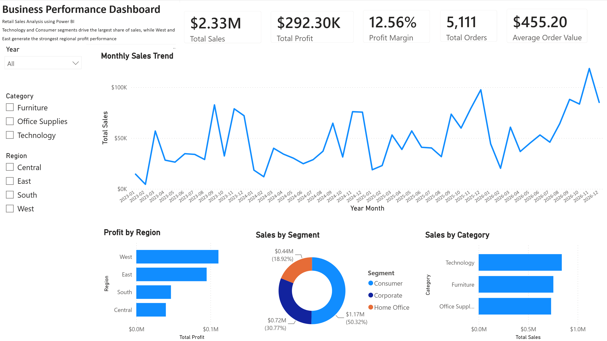

# Business Performance Dashboard – Power BI

## Overview

This project presents an interactive business performance dashboard built in Microsoft Power BI using the Sample Superstore dataset. The objective is to analyse retail sales performance, profitability, customer segments, product categories, regional performance, and monthly business trends.

The dashboard uses Power BI Desktop, DAX measures, a custom date table, and interactive slicers to support business performance monitoring and management-level decision-making.

---

## Business Problem

Retail management needs a clear and interactive dashboard to monitor overall business performance and answer questions such as:

- How much revenue and profit were generated?
- What is the overall profit margin?
- How many orders were placed?
- Which product categories generated the most sales?
- Which regions contributed the strongest profit performance?
- Which customer segments drove the largest share of sales?
- How did monthly sales change over time?

This dashboard helps convert raw sales data into business insights that can support reporting, planning, and performance review.

---

## Dashboard Preview

---

## Dashboard File

[Download Power BI Dashboard](powerbi/Business_Performance_Dashboard.pbix)

---

## Report

[View Executive Summary](report/Executive_Summary_PowerBI.pdf)

---

## Tools Used

- Microsoft Power BI Desktop
- Power Query
- DAX
- Data Modeling
- GitHub

---

## Dashboard Features

The Power BI dashboard includes:

- KPI cards for total sales, total profit, profit margin, total orders, and average order value
- Monthly sales trend analysis
- Sales by product category
- Profit by region
- Sales by customer segment
- Interactive slicers for year, category, and region
- Custom date table for time-based analysis
- DAX measures for business KPI calculation

---

## DAX Measures

Key DAX measures created in this project include:

| Measure | Description |
|---|---|
| `Total Sales` | Calculates total revenue |
| `Total Profit` | Calculates total profit |
| `Profit Margin` | Calculates profit as a percentage of sales |
| `Total Orders` | Counts unique orders |
| `Total Customers` | Counts unique customers |
| `Average Order Value` | Calculates average revenue per order |
| `Total Quantity` | Calculates total quantity sold |
| `Average Discount` | Calculates average discount rate |

---

## Key Insights

- Total Sales reached **$2.33M**.
- Total Profit reached **$292.30K**, with a **12.56%** profit margin.
- The business generated **5,111** total orders.
- Average Order Value was approximately **$455.20**.
- Technology was the highest-performing product category by sales.
- Consumer customers contributed the largest share of total sales.
- The West and East regions generated the strongest profit performance.
- Monthly sales showed clear variation over time, highlighting the importance of trend monitoring.

---

## Business Recommendations

- Continue prioritising high-performing categories such as Technology.
- Monitor profit margin alongside sales to avoid focusing only on revenue growth.
- Use regional performance insights to understand why West and East outperform other regions.
- Review lower-profit regions and identify possible discounting, pricing, or operational issues.
- Use monthly trend analysis to support sales forecasting, campaign planning, and inventory decisions.
- Use customer segment insights to design targeted marketing and retention strategies.

---

## Project Structure

~~~text
Business-Performance-Dashboard-PowerBI
│
├── data
│   └── sample_-_superstore.xls
│
├── powerbi
│   └── Business_Performance_Dashboard.pbix
│
├── images
│   └── PowerBI_Dashboard.png
│
├── report
│   └── Executive_Summary_PowerBI.pdf
│
├── README.md
└── LICENSE
~~~

---

## Skills Demonstrated

- Power BI dashboard development
- DAX measure creation
- Data modeling
- Date table creation
- KPI reporting
- Interactive slicer design
- Time-series analysis
- Sales and profitability analysis
- Regional performance analysis
- Customer segment analysis
- Business insight generation
- Executive dashboard design

---

## Dataset

Sample Superstore dataset.
